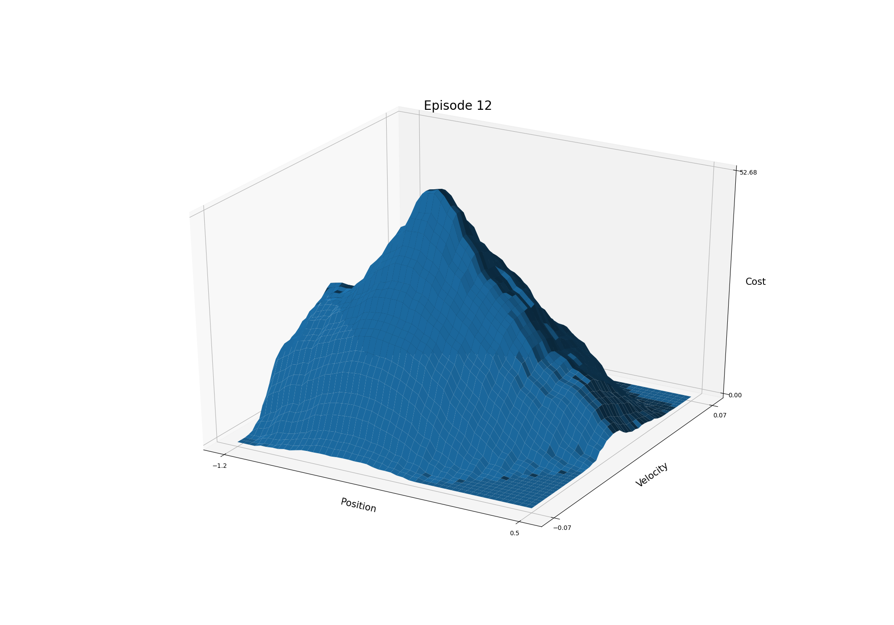
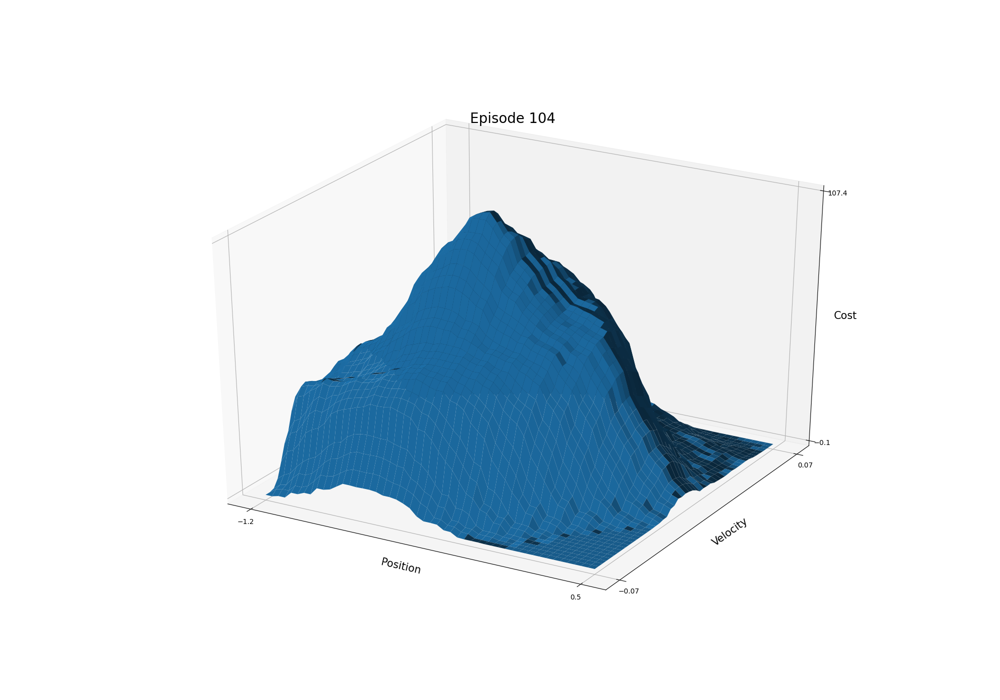
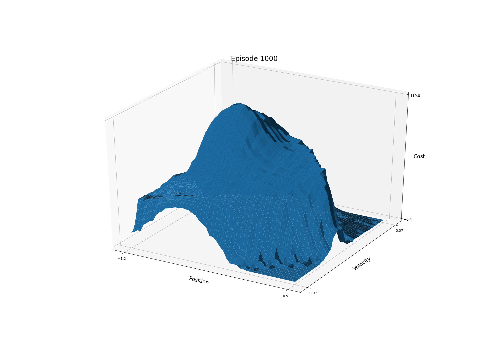
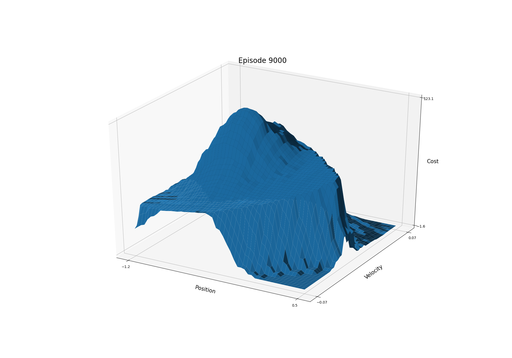
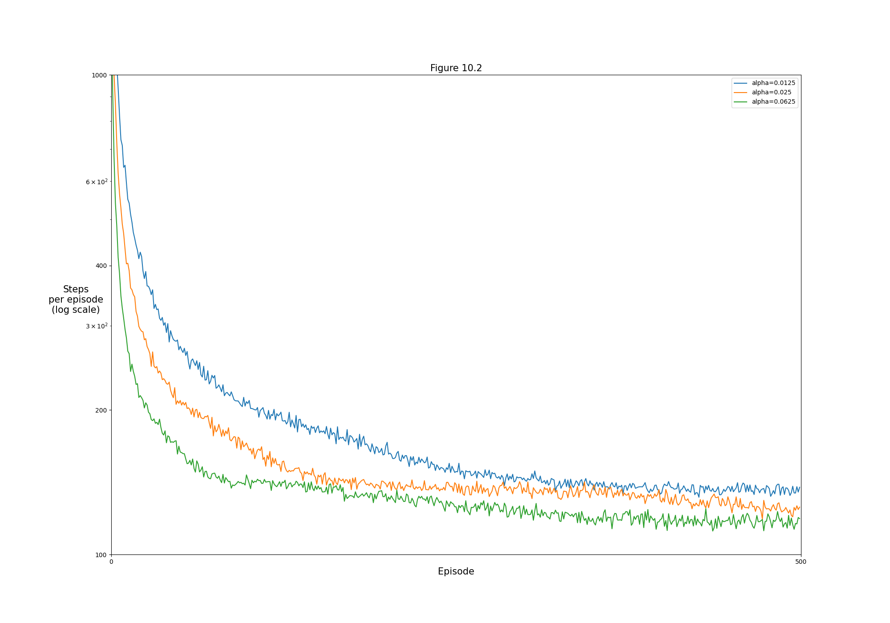
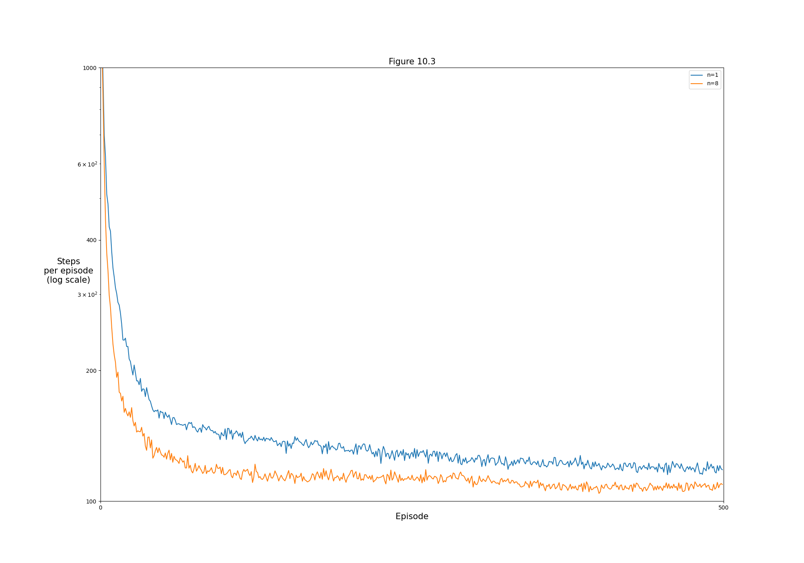
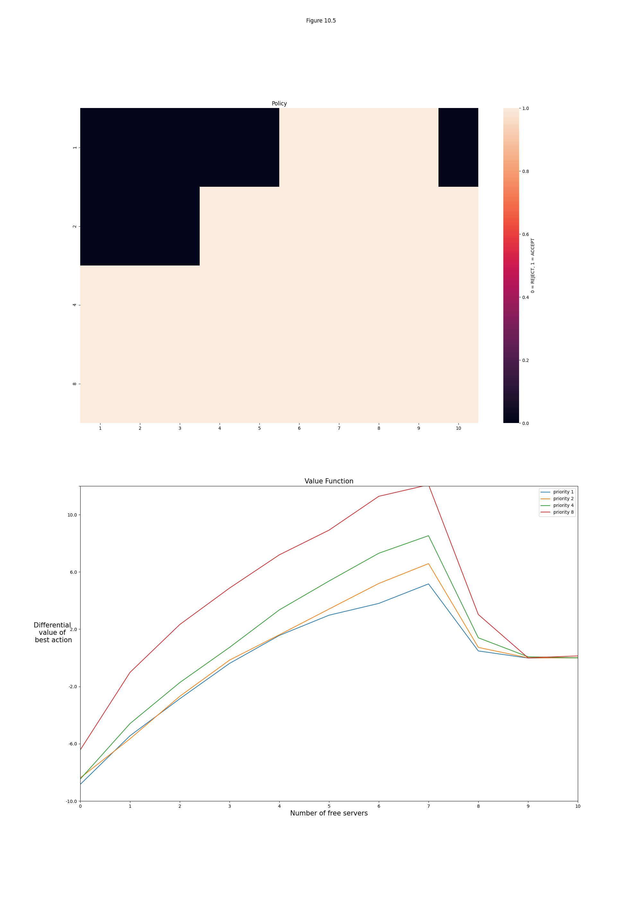

## Figures

### Figure 10.1:












```bash
python figures 10.1
```

### Figure 10.2:




```bash
python figures 10.2
```

### Figure 10.3:




```bash
python figures 10.3
```

### Figure 10.5:




```bash
python figures 10.5
```
