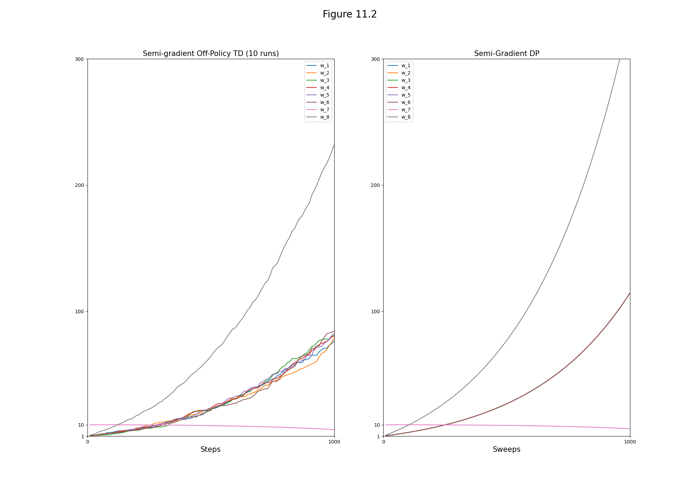
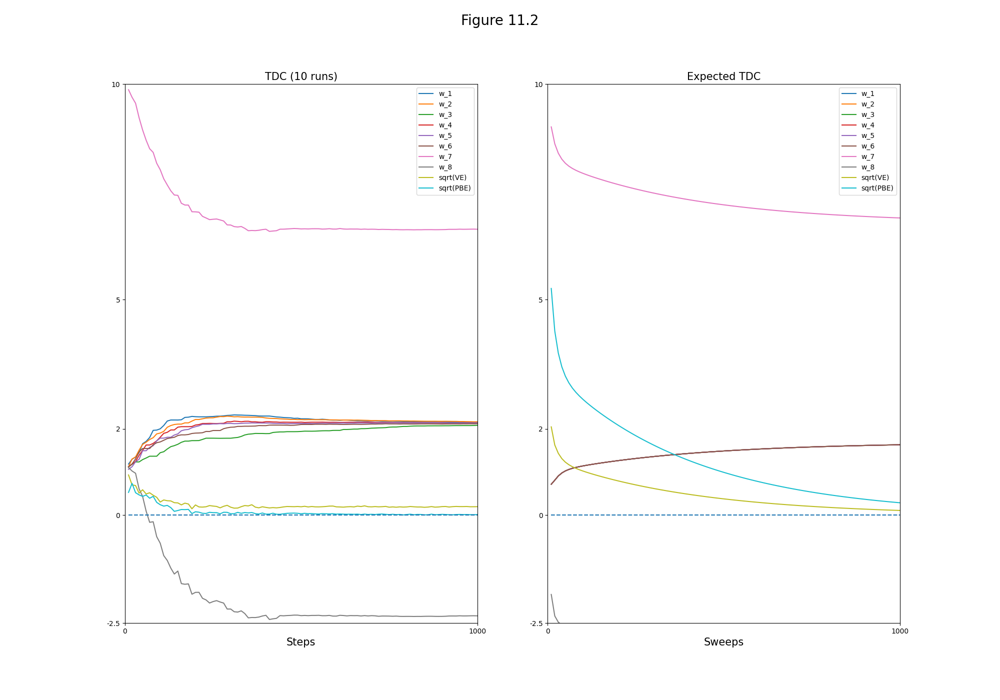
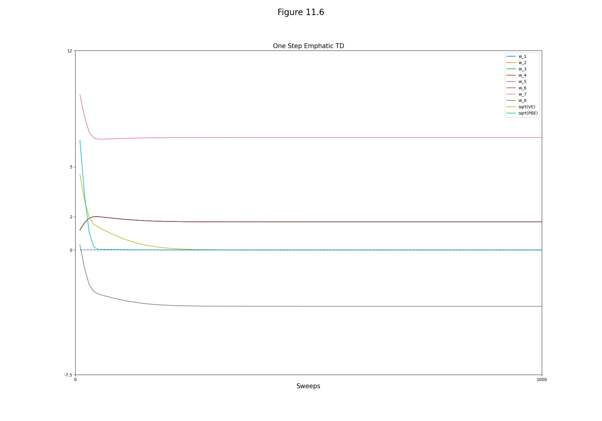
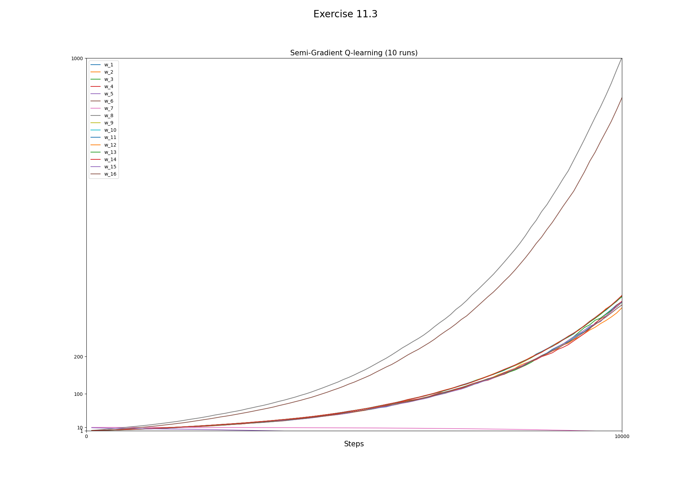

## Figures

### Figure 11.2:



```bash
python figures 11.2
```

### Figure 11.5:



```bash
python figures 11.5
```

### Figure 11.6:



```bash
python figures 11.6
```

## Exercises

### Exercise 11.3



```bash
python figures ex11.3
```
