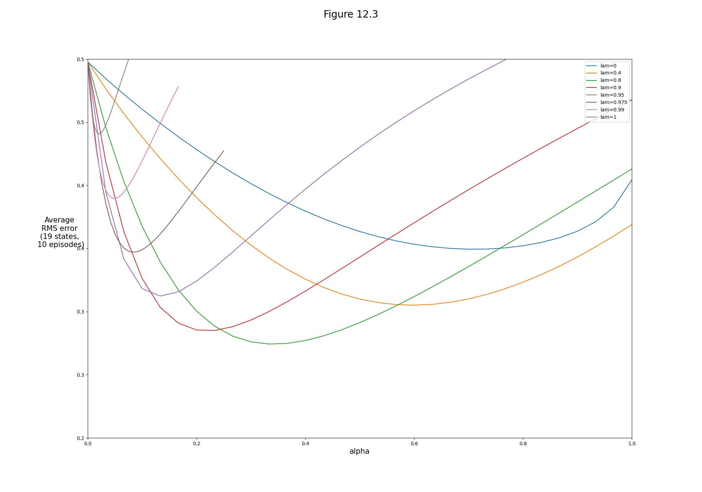
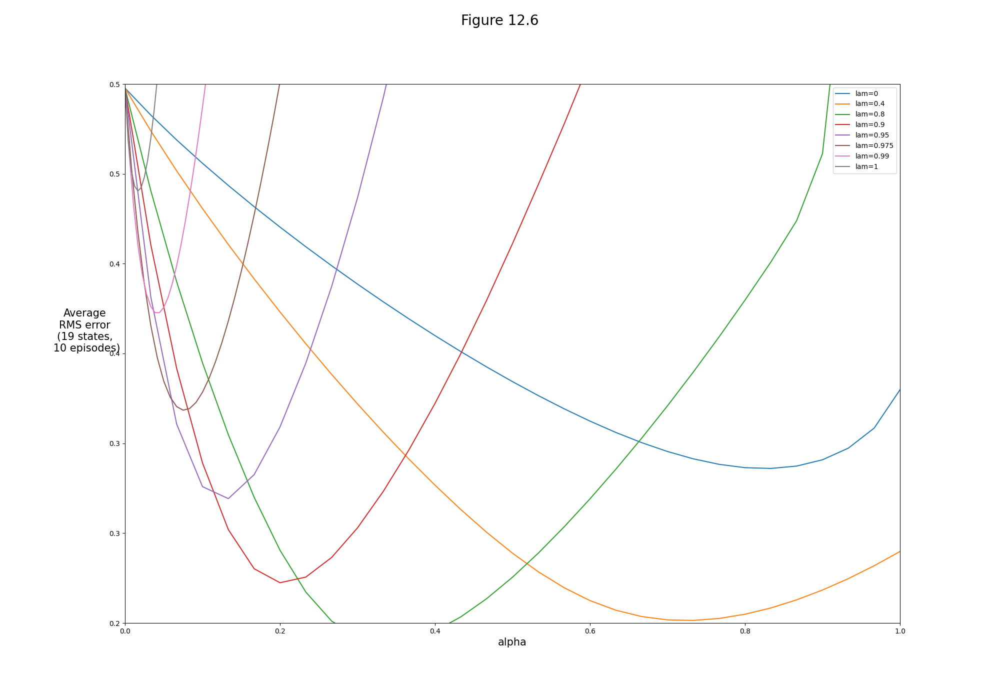
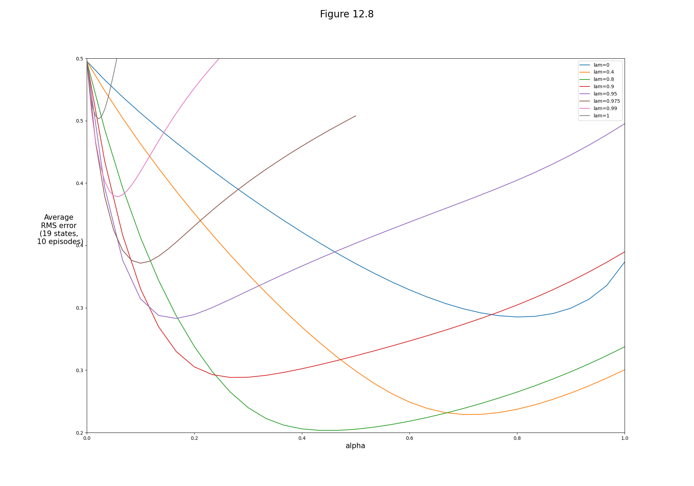
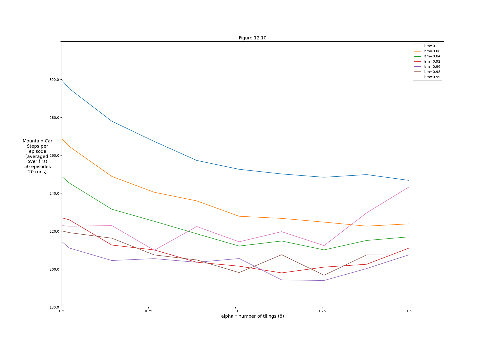
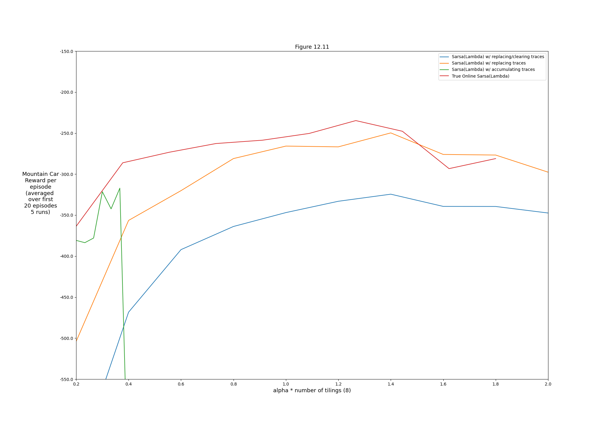

## Figures

### Figure 12.3:



```bash
python figures 12.3
```

### Figure 12.6:



```bash
python figures 12.6
```

### Figure 12.8:



```bash
python figures 12.8
```

### Figure 12.10:



```bash
python figures 12.10
```

### Figure 12.11:



```bash
python figures 12.11
```
