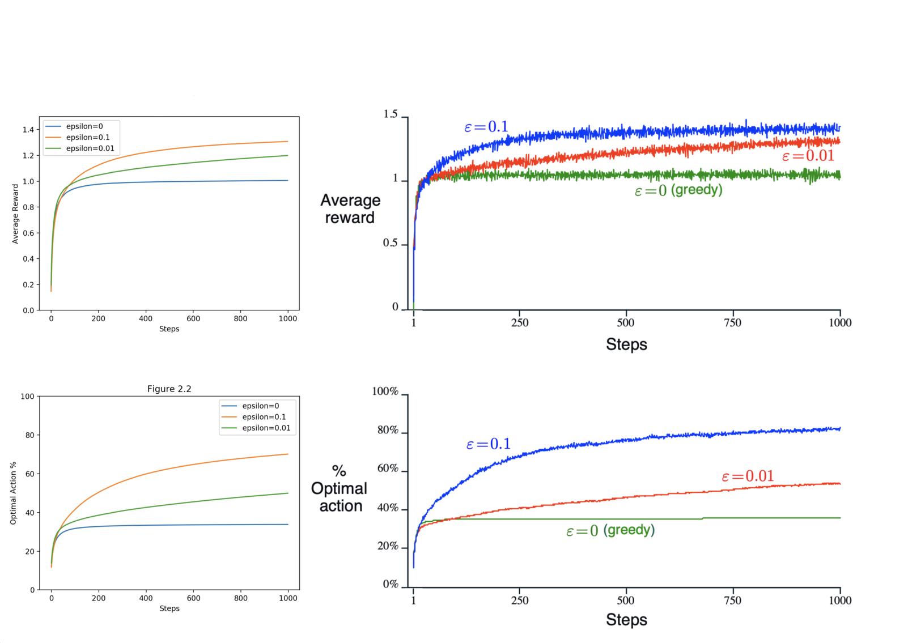
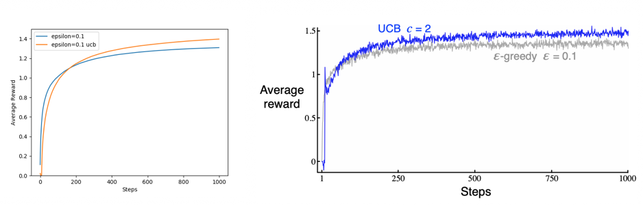

## Figures

### Figure 2.2



```bash
python figures.py 2.2
```

### Figure 2.3


```bash
python figures.py 2.3
```

### Figure 2.4



```bash
python figures.py 2.4
```

### Figure 2.5


```bash
python gradient_bandit.py
```

### Figure 2.6:


```bash
python summary.py 2.6
```

## Exercises

### Exercise 2.5


```bash
python figures ex2.5
```

### Exercise 2.11


```bash
python summary ex2.11
```
