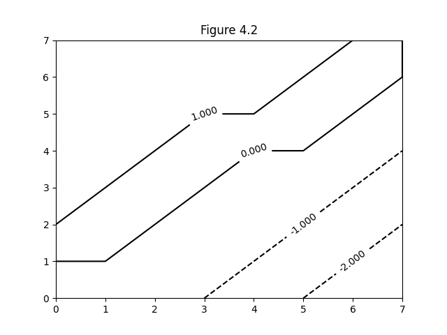
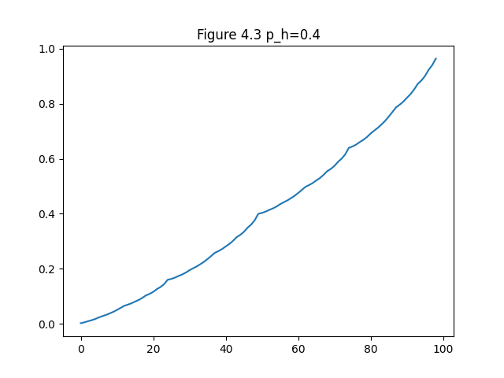
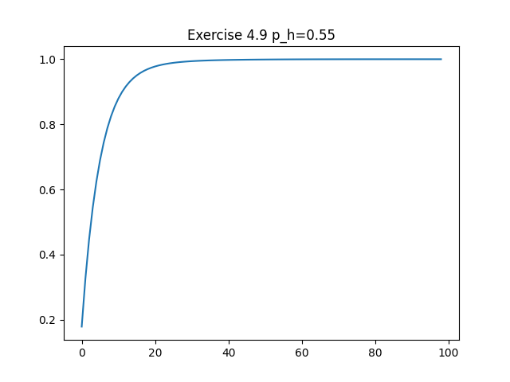

## Figures

### Figure 4.1:

```
printing value function V
[[  0. -14. -20. -22.]
 [-14. -18. -20. -20.]
 [-20. -20. -18. -14.]
 [-22. -20. -14.   0.]]
printing policy gridworld
['LEFT ', 'LEFT ', 'LEFT ', 'LEFT ']
['UP   ', 'UP   ', 'LEFT ', 'DOWN ']
['UP   ', 'UP   ', 'DOWN ', 'DOWN ']
['UP   ', 'RIGHT', 'RIGHT', 'RIGHT']
```

```bash
python figures 4.1
```

### Figure 4.2:




```bash
python figures 4.2 --size 8
```

### Figure 4.3:




```bash
python figures 4.3
```

## Exercises

### Exercise 4.7


```bash
python figures ex4.7
```

### Exercise 4.9





```bash
python figures ex4.9
```
