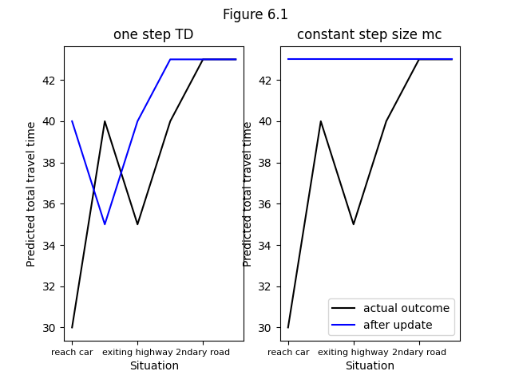
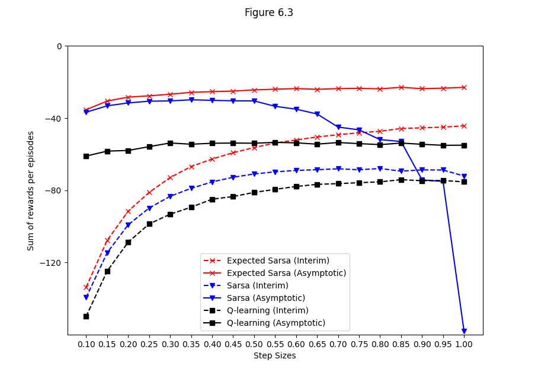
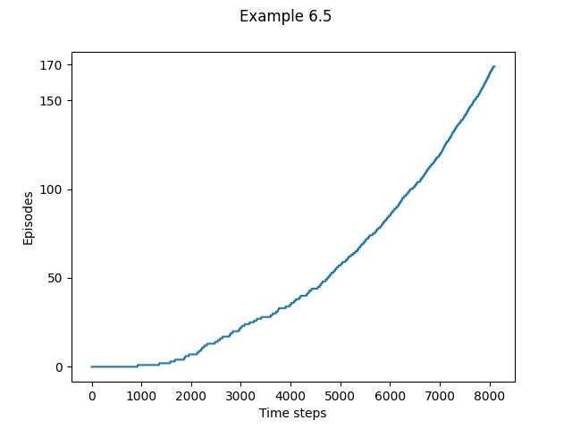
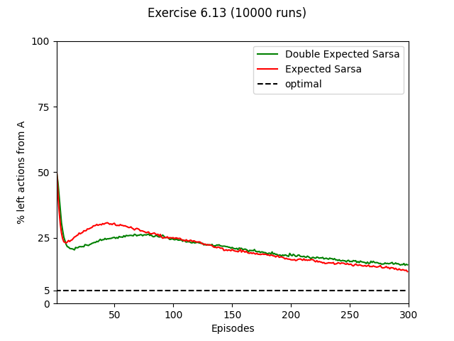

## Figures

### Figure 6.1:




```bash
python figures 6.1
```

### Figure 6.2:


```bash
python figures 6.2
```

### Figure 6.3:



```bash
python figures 6.3
```

### Figure 6.5:


```bash
python figures 6.5
```

## Examples


```bash
python figures example6.2
```



```bash
python figures example6.5
```


```bash
python figures example6.6
```

## Exercises

### Exercise 6.4


```bash
python figures ex6.4
```


```bash
python figures ex6.5
```


```bash
python figures ex6.9
```


```bash
python figures ex6.10
```



```bash
python figures ex6.13
```
