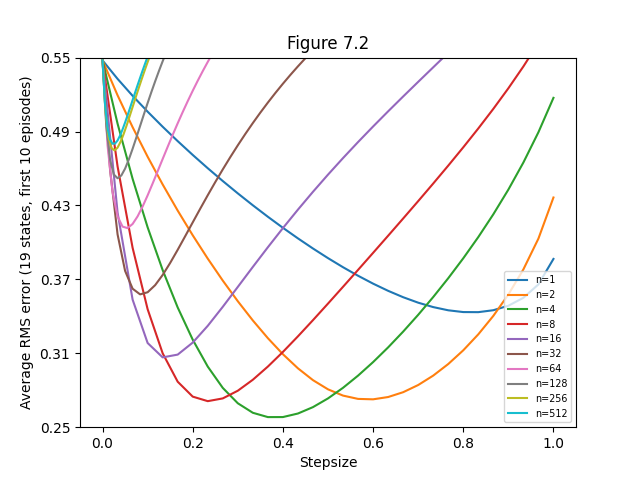
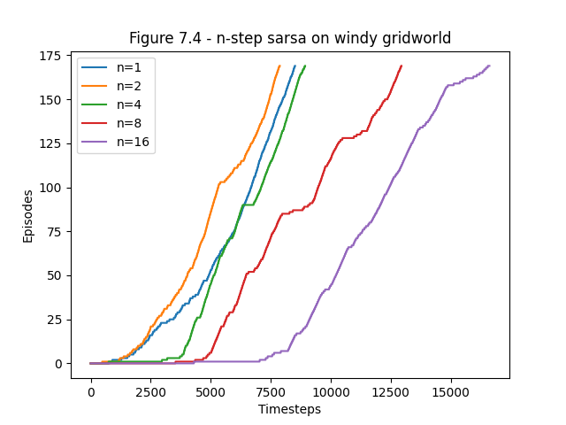
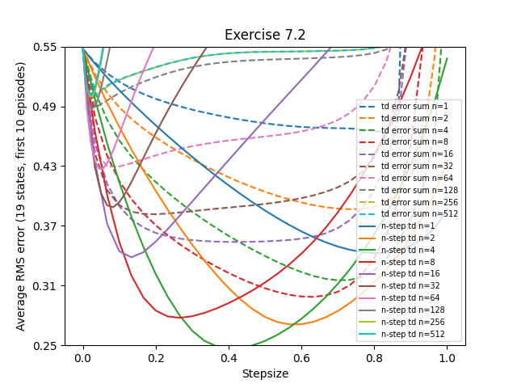
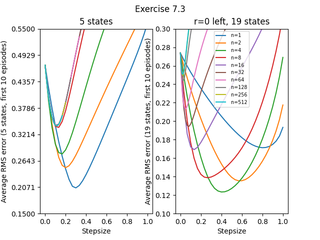
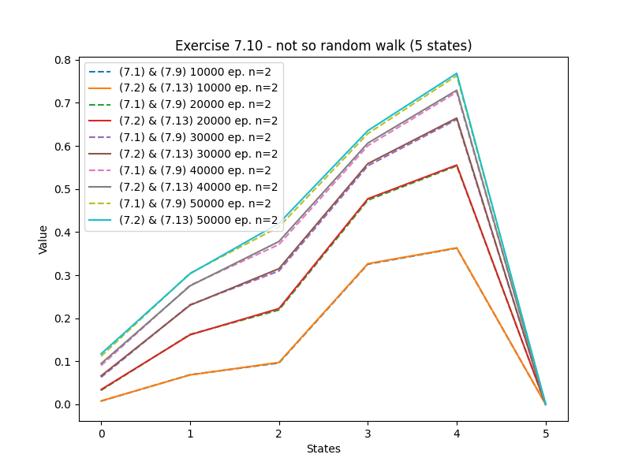
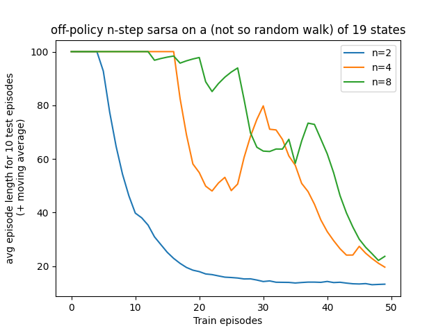
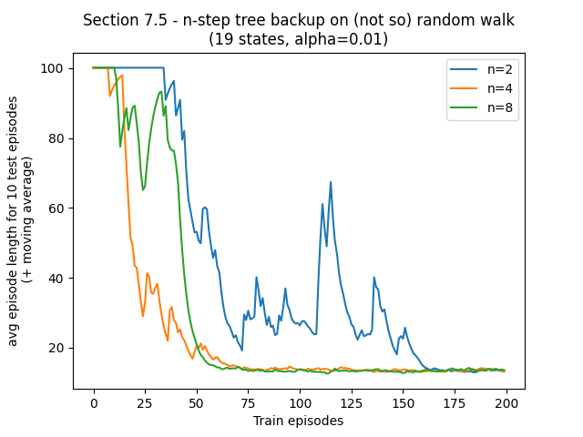
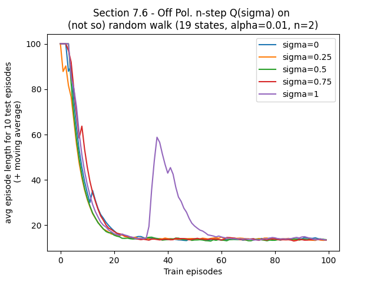

## Figures

### Figure 7.2:




```bash
python figures 7.2
```

### Figure 7.4:

this figure is not in the book--I wanted to launch the off policy nstep sarsa algorithm on the windy gridworld with n greater than 2, as was suggested by the fig7.4 from the book




```bash
python figures 7.4
```

## Exercises

### Exercise 7.2



```bash
python figures ex7.2
```



```bash
python figures ex7.3
```



```bash
python figures ex7.10
```

## Sections

implementation of algorithms from section 3, 5 and 7, tested with different values of n on a modification of the random walk, not actual exercises or figures from the book (but uses pseudo-code from corresponding sections).

### Section 7.3




```bash
python figures section7.3
```



```bash
python figures section7.5
```



```bash
python figures section7.6
```
