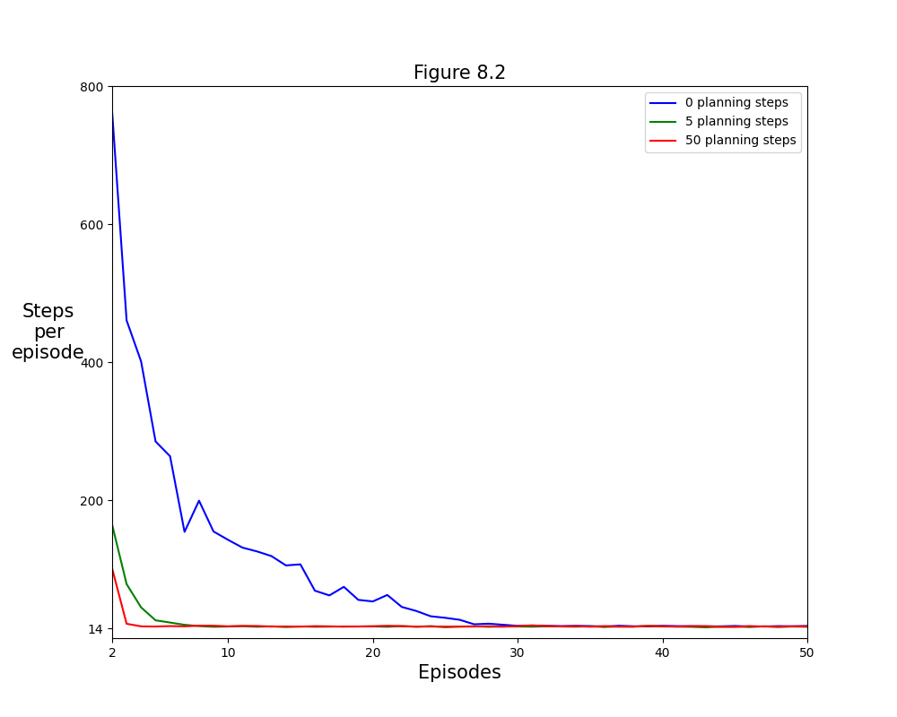
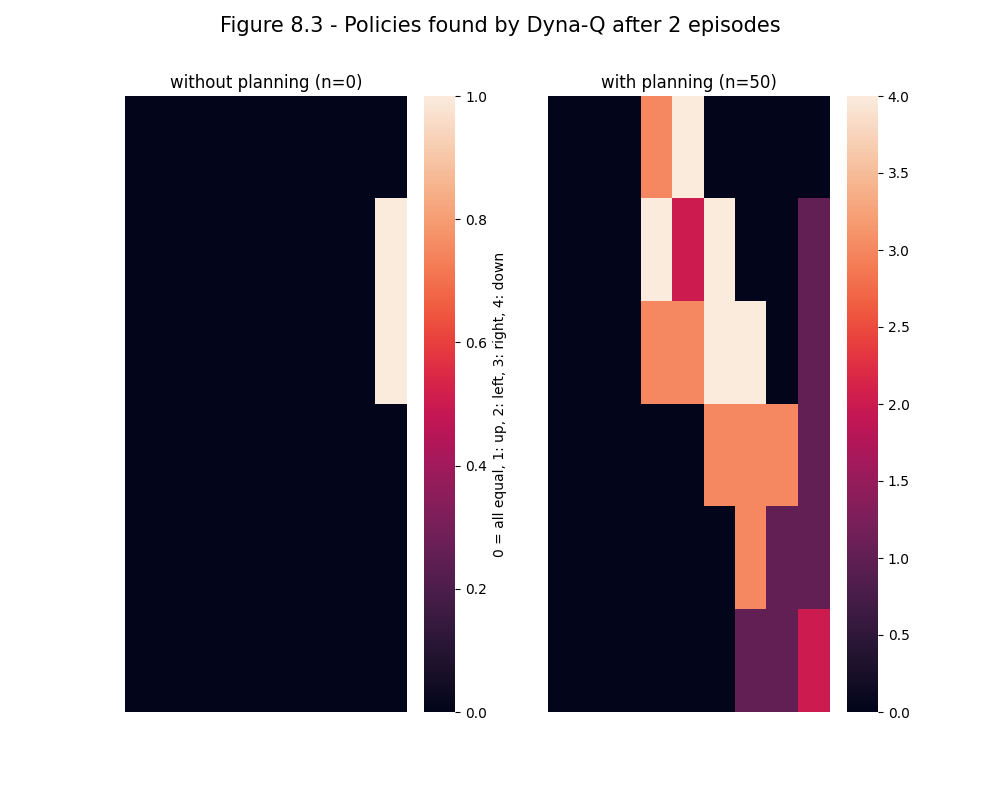
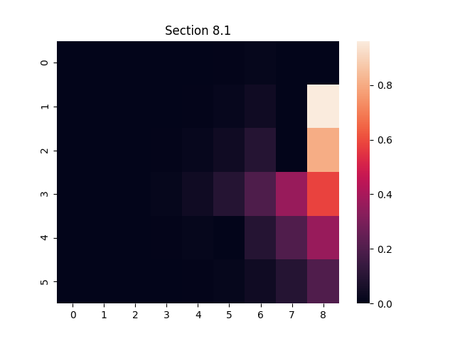

## Figures

### Figure 8.2:




```bash
python figures 8.2
```

### Figure 8.3:




```bash
python figures 8.3
```

## Sections

### Section 8.1

testing the random-sample one-step tabular q-planning algorithm with the dynamaze environement, assuming we have access to a perfect model of the environment. step size decays to 0 by multiplying by `(1 - 1 / n_updates)` every step.



```bash
python figures section8.1
```
