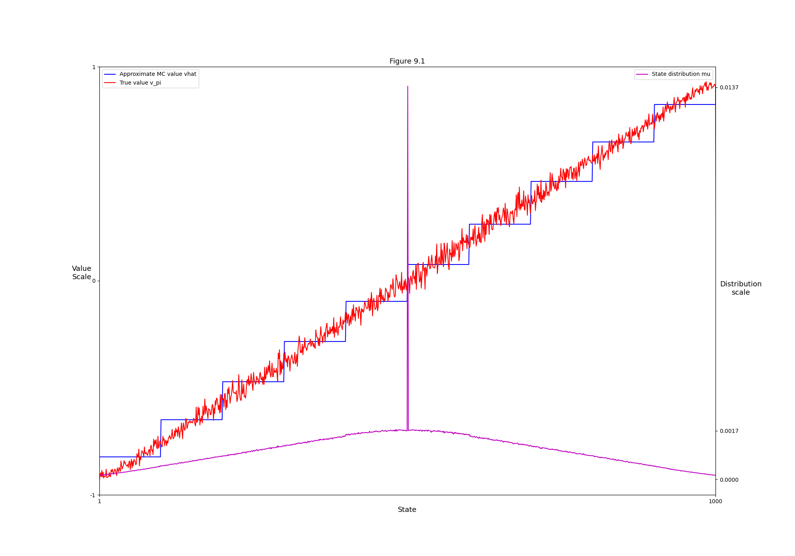
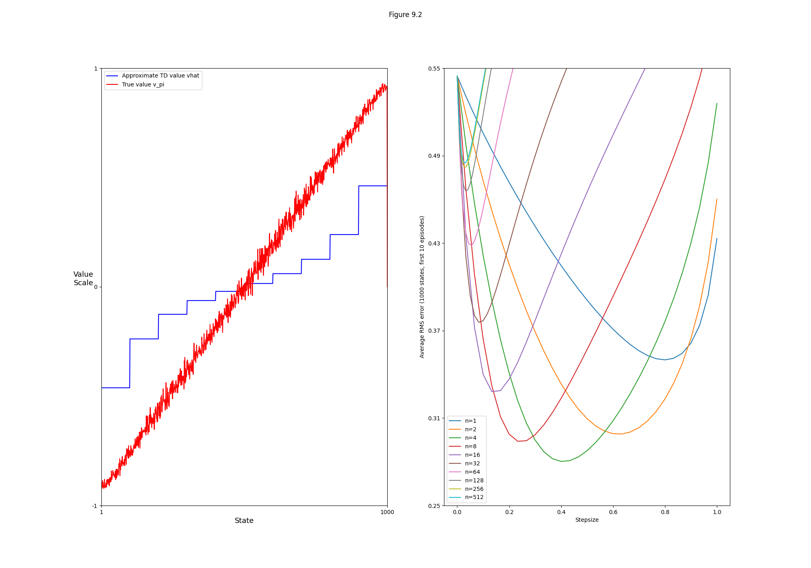
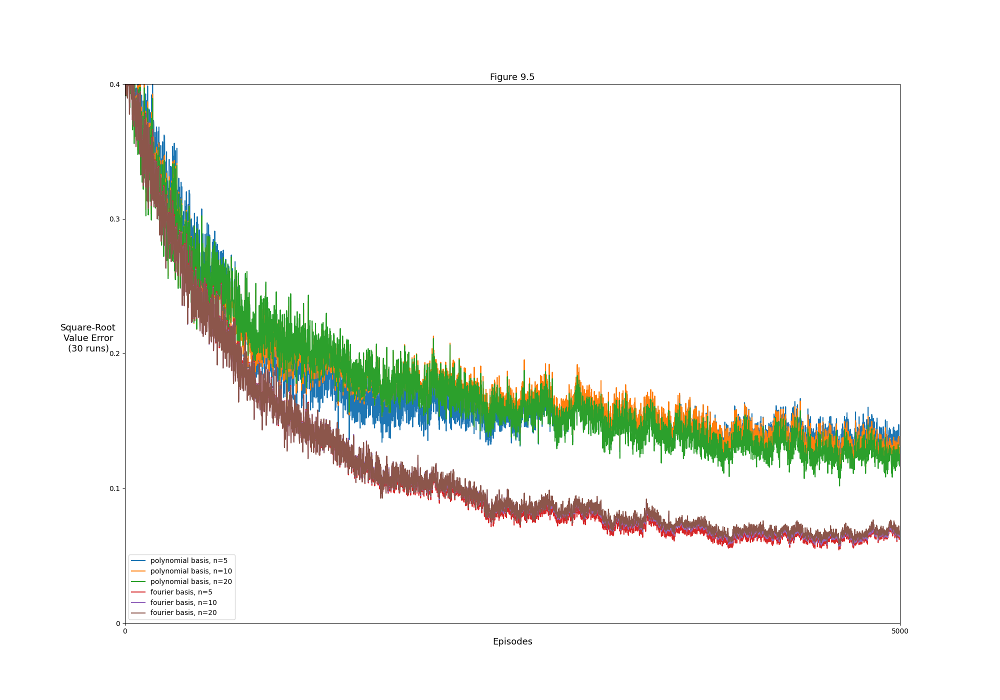
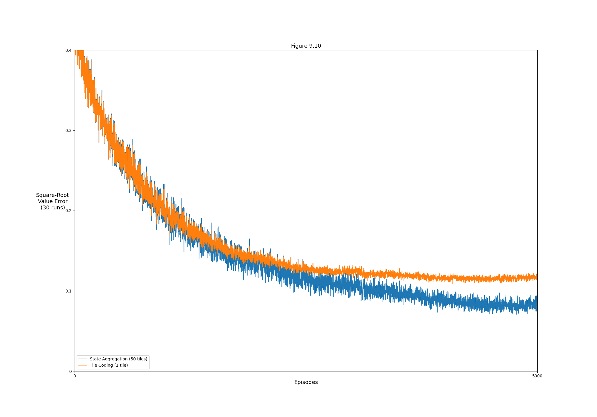

## Figures

### Figure 9.1:




```bash
python figures 9.1
```

### Figure 9.2:




```bash
python figures 9.2
```

### Figure 9.5:




```bash
python figures 9.5
```

### Figure 9.10:




```bash
python figures 9.10
```
