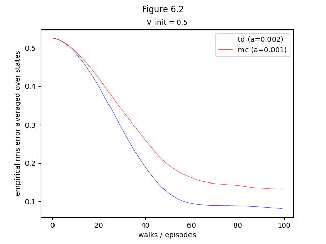
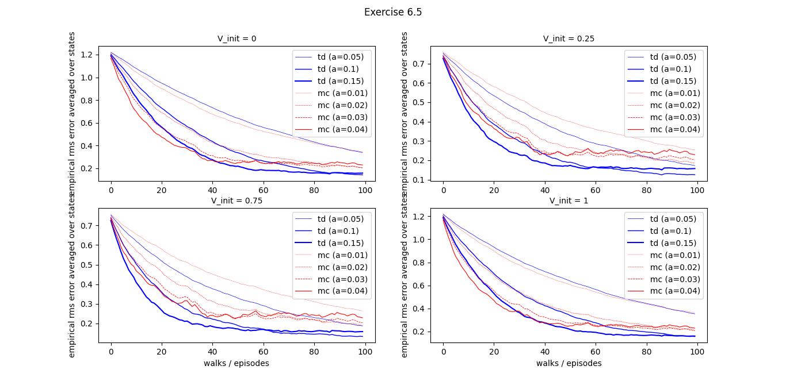

'6.1': fig_6_1,
'example6.2': example_6_2,
'ex6.4': ex_6_4,
'ex6.5': ex_6_5,
'6.2': fig_6_2,
'ex6.7': ex_6_7,
'example6.5': example_6_5,
'ex6.9': ex_6_9,
'ex6.10': ex_6_10, 
'example6.6': example_6_6,
'6.3': fig_6_3,
'6.5': fig_6_5,
'ex6.13': ex_6_13,
'ex6.14': ex_6_14,

## Figures

### Figure 6.1:


```bash
python figures 6.1
```

### Figure 6.2:



```bash
python figures 6.2
```

### Figure 6.3:


```bash
python figures 6.3
```

### Figure 6.5:


```bash
python figures 6.5
```

## Examples


```bash
python figures example6.2
```


```bash
python figures example6.5
```


```bash
python figures example6.6
```

## Exercises

### Exercise 6.4


```bash
python figures ex6.4
```



```bash
python figures ex6.5
```


```bash
python figures ex6.9
```


```bash
python figures ex6.10
```


```bash
python figures ex6.13
```
