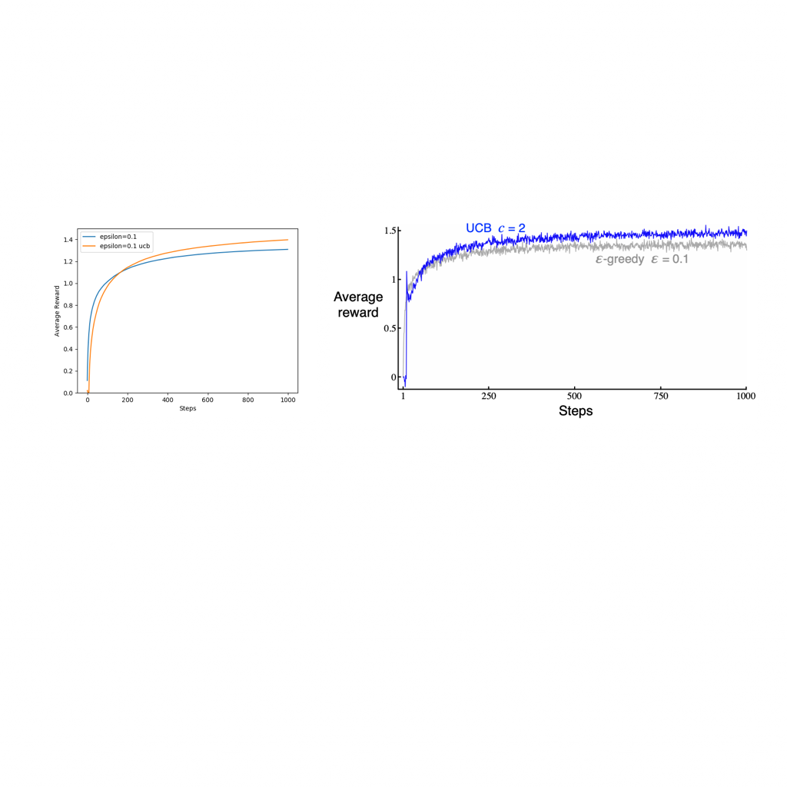
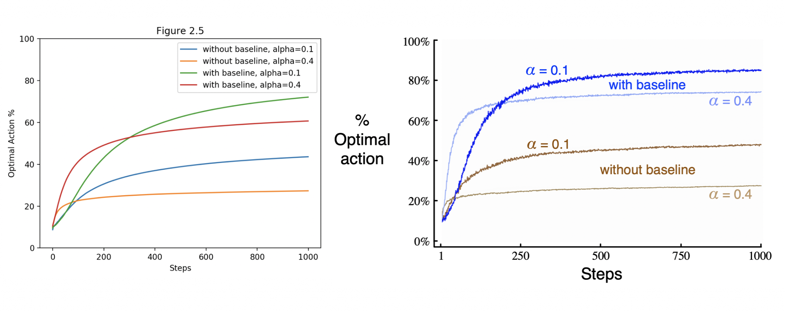
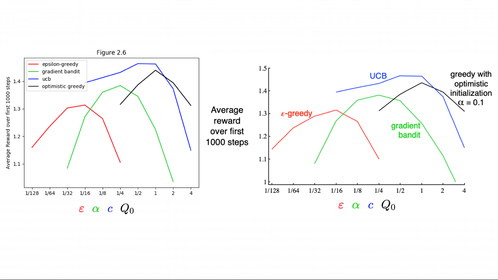

# Reproducing the plots

## Chapter 2

### Figure 2.2


```bash
python figures.py 2.2
```

### Figure 2.3


```bash
python figures.py 2.3
```

### Figure 2.4



```bash
python figures.py 2.4
```

### Figure 2.5


```bash
python gradient_bandit.py
```


### Figure 2.6:



```bash
python summary.py 2.6
```

### Figure 4.2:


```bash
python figures 4.2 --size 8
```

(theoretically, removing --size defaults to 20 and would give something similar to the 20x20 example from the book)
